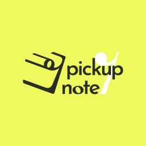

<!--

**Here are some ideas to get you started:**

🙋‍♀️ A short introduction - what is your organization all about?
🌈 Contribution guidelines - how can the community get involved?
👩‍💻 Useful resources - where can the community find your docs? Is there anything else the community should know?
🍿 Fun facts - what does your team eat for breakfast?
🧙 Remember, you can do mighty things with the power of [Markdown](https://docs.github.com/github/writing-on-github/getting-started-with-writing-and-formatting-on-github/basic-writing-and-formatting-syntax)
-->

<h1 align="center">Welcome to pickupnote</h1>

  

  
  

<a href="https://pickupnote.com">Website</a> | <a href="https://apps.apple.com/app/pickupnote-collect-my-music/id6478777973">Download</a>

Sounds picked up will resonate again.

pickupnote（including services provided by products like the mobile App）was developed and operated by product designer ilex（冬青）, engineer Eddie (老仙), [kiokh](https://github.com/kiotlin), and lu zhao.

## The Birth of pickupnote

The idea for pickupnote came from an [article](https://sspai.com/post/83174) on the Chinese Tech-media platform "sspai". In the article, author Shigeru shared how he/she recorded the music they listened to. Some people didn't understand why they would bother to record something as relaxing as listening to music.

I (ilex) was touched by this practice. Since 2017, I have been recording good music I hear in various ways: creating playlists on streaming platforms, building databases using Excel or Notion... At the end of each year, I would "select" my top ten favorite albums -- it's for my own enjoyment, but looking back year after year, I can clearly perceive changes in my taste.

I have music enthusiasts around me, some of whom are skilled musicians, some who deeply care about the cultural background behind the music, and some who consider going to live as part of their lives. Their relationship with music has long surpassed mere consumption. So I thought, perhaps there are many others who don't want to forget the music they truly care about and the times that accompany it.

Thus, pickupnote was born. It started as a simple web project initiated by me and kiokh. With the addition of eddie and lu zhao, it evolved into a complete application. Here, you can record everything about music, either as a keepsake or to share with others. The sounds you don't want to forget will always resonate once more. Enjoy using it, friends.

## The Features of pickupnote

- It is focused. This tool is specifically designed for "recording sound scenes."
- It is simple. All you need to do is bind each diary entry with a specific piece of music, which can be done within 3 seconds. With tags and search, you can easily find those important moments accompanied by music.
- It is clean. The interface of "pickupnote" is simple, and we promise to never include ads. The revenue of "pickupnote" will come entirely from membership fees. This means we have no need to sell your privacy information.
- It loves music, daily life, and you.

## Become our good friend

You can also find us on the following SNS to see what interesting things we are up to.

- [即刻](https://okjk.co/XfwCJ1)
- [X](https://twitter.com/pickupnote)

If you have any questions or suggestions, please contact us at **pickupnote@163.com**.
